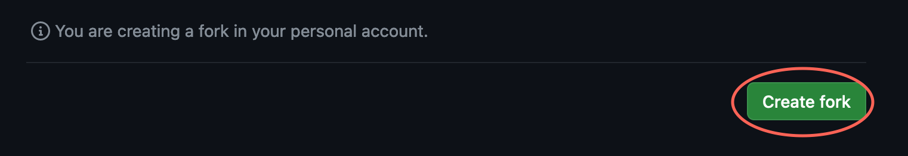
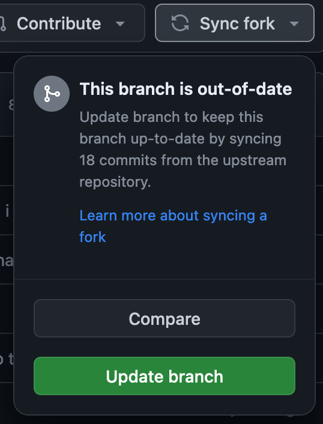
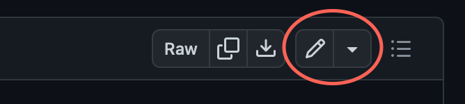
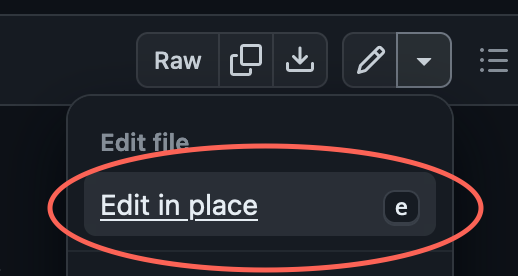
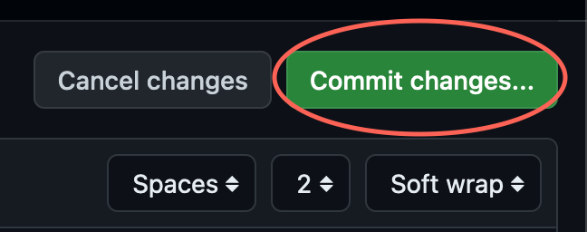
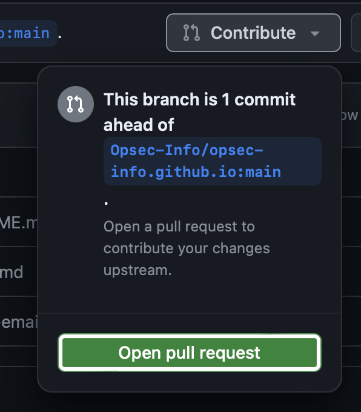
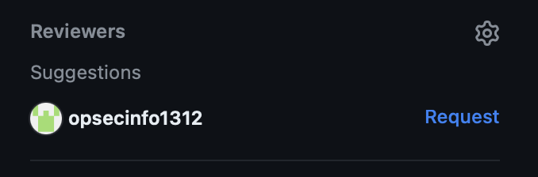

# Contributing
Thank you for helping keep this information up-to-date! In order to keep you safe, we recommend the following:

1. Set up a siloed GitHub account for only this work, using your discretion when filling out identifying information.
2. Only make changes through the GitHub web interface.

# Making a siloed GitHub account
## What
Set up a GitHub account that's only used for updating information here.

## Why
If you reuse a GitHub account or the username for the account with other services that are publicly identifiable as you, anyone can correlate your identity between different websites and connect that you have submitted the information here. This could connect tactics or knowledge to your identity and risk your safety and the safety of the actions you participate in.

## How
1. [Create a siloed email for this purpose](siloed-email.html)
2. [Create a new GitHub account](https://github.com/signup)
  - Make sure you:
    - Don't use a similar username to any non-siloed accounts you have
    - Don't use anything that could link back to your identity

# Using the web interface to make changes
## What
GitHub provides a web interface that allows editing the pages of this website.

## Why
The primary other means of pushing changes to this website is through a Git client which typically stores identity information for a specific user across all projects that they work on. This identity information can be changed, but it's also very easy to forget to change the information or ensure it accurately reflects the account and identity you wish to submit changes under. Using the web interface ensures that you are submitting under the correct identity because it pulls the identity info from your user account.

## How
Your first change will work slightly differently than all subsequent changes. This is because GitHub requires you to make a local copy of the website for your user to edit and then request that your changes be adopted by the main page.

### Making a copy you can edit
If this is your first time making a change to the website with this user account, follow these steps:

1. Go to [the project's main page on GitHub](https://github.com/Opsec-Info/opsec-info.github.io/).
2. Click the "Fork" button:

3. On the next page, keep all the settings the same and click the "Create fork" button:

  - This will create a personal copy in your user's account that you are able to edit freely.

### Making changes
If you've started making changes (even if you attempted to merge them and they were not adopted), follow these steps to make additional changes:

1. Go to your copy of the main project page at ```https://github.com/YOUR_USERNAME/opsec-info.github.io/``` replacing ```YOUR_USERNAME``` with your siloed username.
2. There will be text next to the "Contribute" and "Sync fork" buttons that says one of the following:
  - "This branch is up to date with OpsecInfo/opsec-info.github.io:main"
    - You are editing the latest version and you can go to step 3.
  - "This branch is ## commits behind OpsecInfo/opsec-info.github.io:main" (where the ## is some number)
    - Your local copy doesn't contain some more recent changes from the main website. To make sure you have the latest version to edit from:
      - Click "Sync fork"
      - Click "Update branch"

      - When the process is done, it should update to "This branch is up to date with OpsecInfo/opsec-info.github.io:main" and you can continue to step 3.
  - "This branch is ## commits ahead of OpsecInfo/opsec-info.github.io:main"
    - Your local copy likely has edits you've made, but not yet fully merged into the main website.
    - You can go to step 3.
3. Find the page you want to edit by changing the url prefix from ```https://opsec-info.github.io/``` to ```https://github.com/YOUR_USERNAME/opsec-info.github.io/tree/main/``` and the suffix from ```.html``` to ```.md```.
  - For example if you are editing this page, you would change the url from ```https://opsec-info.github.io/contributing.html``` to ```https://github.com/YOUR_USERNAME/opsec-info.github.io/tree/main/contributing.md```.
  - In these examples you would change out ```YOUR_USERNAME``` to your siloed username.
4. Click the pencil icon to display the edit menu:

5. Click the "Edit in place" option in the drop-down menu:

6. Make your edits to the page.
  - You can learn more about the formatting for the page in [this guide from GitHub](https://docs.github.com/en/get-started/writing-on-github/getting-started-with-writing-and-formatting-on-github/basic-writing-and-formatting-syntax).
7. Save your changes by using the "Commit changes..." button:

8. You can make additional edits now and when you're ready, follow the instructions below in **Merging your changes with the main site**.

### Merging your changes with the main site
Once you've made changes in your user's local copy of the website, you need to request that those changes be merged in to the main website.  This process involves creating a request and writing up a short explanation of what changes you made and why so that the moderators can review it before it's shared widely.

1. Go to your user copy of the website at ```https://github.com/YOUR_USERNAME/opsec-info.github.io/``` replacing ```YOUR_USERNAME``` with your siloed username.
  - If this doesn't exist, you may not have made a change yet, and you should follow the instructions above under **Making a copy you can edit**.
2. Click the "Contribute" button and then "Open pull request":

3. Then click "Create pull request":

4. Give the request a title summarizing what you changed.
5. Optionally provide additional information that will help the moderators review your change in the larger text box.
6. Request a review from one of the admins using the recommended reviewers section:

7. Click "Create pull request":

8. When your review is approved, you will be able to merge your pull request using the "Merge pull request" button:

9. GitHub will take a few minutes to rebuild the website, so your changes may not appear immediately.
