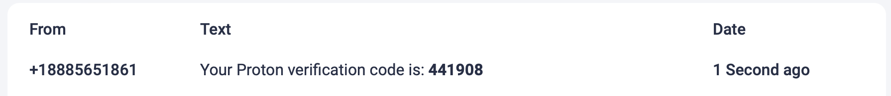

# Siloed Email

We encourage creating an email for specific purposes to not sharing concerns across identies. We suggest: 

1. Making a [protonmail](https://protonmail.com/signup) email [^1]
    - It'll ask for username, password, plan (select free), walk through a captcha, and set a display name. You can skip the recovery email and phone number when it asks here.

3. Using [AnonymSMS](https://anonymsms.com/) for phone verification [^2]
    - Click on a phone number and copy it
    - In proton mail, click on your initials in the upper right corner

      
      
    - Click on "Settings"

      

    - Click "Recovery" on the left sidebar

      

    - Scroll to "Recovery phone number"
  
      

    - Input the phone number you selected from AnonymSMS
    - Click save and a pop up will appear for a code
    - Go back to AnonySMS, wait a few seconds, and refresh the page
    
      

    - Copy and paste the verification code shown back into the proton mail pop up

3. You're good to go! Use this email to set up related accounts needed. 

[^1]: Many emails require some kind of verification or backup email with different restrictions. Proton is flexible enough to allow this form of verification through. 
[^2]: There are many online sites to grab free phone numbers and you're welcome to find one that works for you. We've found this one to be reliable and easily lets you see the text messages that come through. 
